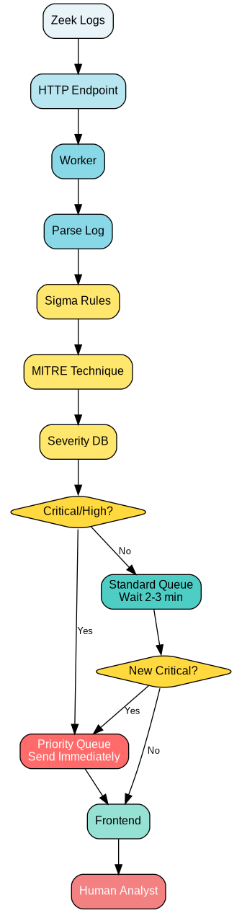

# Security Log Analysis Worker

Rule-based security log worker that processes Zeek logs, maps them to MITRE ATT&CK techniques, and routes alerts by priority.

## Status
**Phase:** Design  
**Timeline:** 8 weeks (12 hrs/week)

## Architecture

## Design Doc
See [DESIGN.md](DESIGN.md) for full design thinking and decisions.

## Tech Stack (Planned)
- Python (log parsing, queue logic)
- Supabase (MITRE severity database)
- Sigma rules (log-to-MITRE mapping)
- HTTP endpoint (log ingestion)
- Loveable (frontend)

